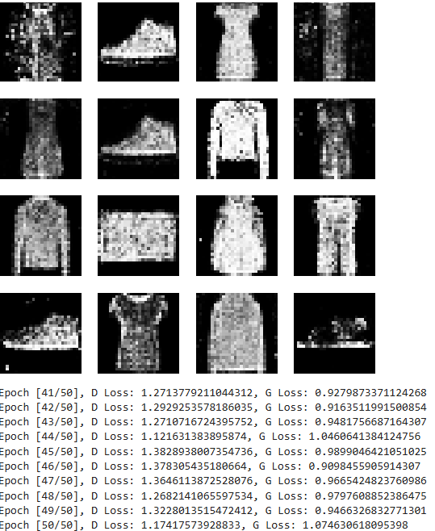

# Generative Adversarial Network (GAN) for Image Generation

This repository contains the implementation of a **Generative Adversarial Network (GAN)** using **PyTorch** to generate synthetic images based on the **FashionMNIST** dataset. The GAN model consists of two parts: the **Generator**, which creates synthetic images, and the **Discriminator**, which attempts to distinguish between real and fake images. Both networks are trained simultaneously in a competitive setting.

## Project Structure

```
├── train.py            # Training script
├── GAN.ipynb           # Notebook
└── requirements.txt    # List of dependencies
```
## Installation

1. **Clone the Repository**:  
   Start by cloning this repository to your local machine:

   ```bash
   git clone https://github.com/itzzzme/GAN-in-pytorch.git
   cd GAN-in-pytorch
   ```

2. **Install Dependencies**:  
   Ensure you have the required dependencies by running:

   ```bash
   pip install -r requirements.txt
   ```

3. **Download the Dataset**:  
   The FashionMNIST dataset will be automatically downloaded when you run the training script.

## Training the GAN

To train the GAN on the FashionMNIST dataset, run the following command:

```bash
python train.py
```

This will start the training process where:
- The **Generator** creates synthetic images.
- The **Discriminator** distinguishes between real (from the dataset) and fake images (from the Generator).
- Both models are trained for 50 epochs by default, and the loss values for both the Generator and Discriminator are printed at each epoch.

## Hyperparameters

The following hyperparameters are used in the training script:
- **Latent Dimension (z_dim)**: 100
- **Learning Rate (lr)**: 0.0002
- **Batch Size**: 64
- **Epochs**: 50

These hyperparameters can be adjusted within the `train.py` script to experiment with different configurations.

## Monitoring Progress

During training, generated images are displayed every 10 epochs to monitor the progress of the Generator. The images are shown in a 4x4 grid format, and over time, you should see the generated images becoming more realistic, resembling items from the FashionMNIST dataset such as t-shirts, trousers, dresses, shoes, bags, etc.

## Running on Kaggle or Notebook Environments

You can also run this GAN project in notebook environments such as **Kaggle Kernels**, **Google Colab**, or **Jupyter Notebooks**. Below are the instructions for setting up and running the project on Kaggle. The steps are similar for other notebook environments.

### Running on Kaggle

1. **Create a `Kaggle Account/Colab Account`**: If you don't have one, sign up at `kaggle.com/colab.research.google.com`.

2. **Open a Notebook**: Go to the `Kaggle/Colab` dashboard and create a new notebook.

3. **Upload the notebook**: Upload it to `kaggle/colab` and run it

## Results

At the end of training, the Generator should produce synthetic images that resemble items from the FashionMNIST dataset, such as t-shirts, trousers, dresses, shoes, bags, etc. While the images may not be perfect, they should capture the general shapes and features of these items.

